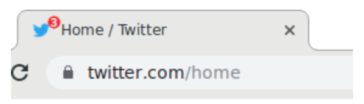
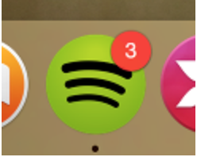

# Service Workers - Badge API

Created: Oct 22, 2020
Created by: Lucas Mallmann
Property: https://web.dev/badging-api/, https://github.com/w3c/badging/blob/master/explainer.md#usage-examples, https://wicg.github.io/background-sync/spec/
Tags: Study, Work

- [Badge Notification API](#)
  - [Overview](#overview)
  - [Objetivos](#objetivos)
  - [Suporte](#suporte)
  - [Badge x Notificações](#badge-x-notificações)
  - [Exemplo](#exemplo)
    - [Display do _Badge_](#display-do-badge)
    - [Source Code](#source-code)
  - [Service Workers](#service-workers)
    - [Background updates](#background-updates)
      - [O problema do Push](#o-problema-do-push)
    - [Periodic Background Sync API](#periodic-background-sync-api)
  - [Combinação de Background Sync & Push API](#combinação-de-background-sync-&-push-api)

# Overview

As _Notification Badge API_ é uma API da plataforma dos browsers é uma Api da Plataforme Web que aplica pequenos indicadores nas páginas, ou nas aplicações instaladas. Existem 2 tipos de indicadores:

- **Document Badges** - aparece no documento da página, geralmente no favicon da aplicação.

  

- **App Badges** - associado com uma aplicação instalada, mostrando o indicador nativo dos sistemas operacionais.

  

  Os app badges são atualizados em background, mesmo quando não há tabs abertas com aquela aplicação.

Os badges notifications são totalmente integrados com os diferentes favicons de cada aplicação. Eles podem ser configurados de diversas formas customizáveis.

- O badge pode aparecer sobrepondo o favicon, ou até mesmo totalmente fora do seu favicon, deixando mais espaço pra marca
- O badge possui um estilo consistente entre os websites, de acordo com o navegador.
- Pode ser identificado através de um leitor de tela (acessibilidade).

# Objetivos

O que se deseja alcançar com os badge notifications?

- Indicar o usuário que existe uma atividade que requer uma certa atenção, sem necessariamente usar um _banner_ de push notification pra fazer isso.
- Mostar um número de notificações ou ações ou informações não lidas.
- Permitir **web apps instaladas** a obter essas informações, independente se estão abertas ou não.

# Suporte

De acordo com a documentação do [web.dev](https://web.dev/badging-api/), a _Badging App API_ funciona nas seguintes plataformas:

- Windows
- MacOS
- ≥ Chrome 81
- ≥ Edge 84
- **Android**: No android, a _Badging API_ não é suportada. Ao invés disso o Android automaticamente mostra um _badge_ no ícone do aplicativo web app instalado quando há notificações não lidas.

# Badge x Notificações

As badge notifications e as push notificactions caminham lado a lado, visto que ambas tem a função de informar o usuário sobre algo que aconteceu em _background._

Porém, existe uma diferença, já que as notificações, [por definição](https://notifications.spec.whatwg.org/#notifications): "Uma notificação é uma representação abstrata de algo que aconteceu, como a entrega de uma mensagem." Os badge notifications são apenas uma representação abstrata do que do estado da aplicação, como por exemplo, mensagens não lidas.

Muitas vezes, é comum usar as badge notifications em conjunto com as push notifications (quando chega um novo e-mail). Porém, há situações em que é mais apropriado usar uma badge notification ao invés de uma push notification:

- Alta frequência de updates.
- Eventos não tão importantes, ou que não relacionam diretamente com o usuário.

Uma grande diferença entre as push notifications é o fato de que as badge notifications **não necessitam de permissão do usuário**.

É possível utilizar ambas as APIs pra implementar notificações, e isso já resolve a maioria dos problemas, como [é explicado aqui](https://www.notion.so/Service-Workers-Badge-API-9f9f4f68cb7844619443a551d13682b6#ee438cdf5ee14b97b1fef77514046abd).

Para entender quando usar um ou outro, apenas pense assim:

- **Alta Prioridade:** Vêm através de uma _push notification_, e o _badge_ é atualizado na hora que a _push_ chega.
- **Baixa prioridade:** _Badge Notification_ é atualizado imediatamente se a página estiver aberta, ou **"eventualmente"** se não há páginas abertas.

Pra entender um pouco mais sobre **urgência x prioridade:**

[Time management](https://en.wikipedia.org/wiki/Time_management#The_Eisenhower_Method)

# Exemplo

A API consiste em dois métodos do objeto `navigator`:

- **setAppBadge(number)**: Define o _badge_ do aplicativo. Se um valor for fornecido, seta o _badge_ com o valor fornecido, caso contrário, exibe um ponto branco simples (ou outro sinalizador conforme apropriado para a plataforma). Definir o número como 0 é o mesmo que chamar `clearAppBadge()`.
- **clearAppBadge()**: Remove o _badge_ da aplicação.

A API é divida em 2 partes: uma para manipular as notificações no documento atual, e outra pra manipular as notificações na app instalada.

```tsx
// sets the number to the document
navigator.setClientBadge(getUnreadCount());

// if you do not pass a value to the clientBadge, it will assume to show only an indicator.
if (myTurn()) navigator.setClientBadge();
// only shows an indicator, and not a counter
else navigator.clearClientBadge();
```

O exemplo acima insere o badge apenas na tab aberta, sem afetar as outras, mesmo que tenham a mesma URL. Para inserir um badge na aplicação como um todo, você pode fazer o seguinte:

```tsx
navigator.setAppBadge(getUnreadCount());
```

A API do app tem prioridade sobre o document, e os valor que é inserido nela sobrescreve o que está no document.

```tsx
// Should be called whenever the unread count changes (new mail arrives, or mail
// is marked read/unread).
function unreadCountChanged(newUnreadCount) {
  // Set the app badge, for app icons and links. This has a global and
  // semi-permanent effect, outliving the current document.
  if (navigator.setAppBadge) {
    navigator.setAppBadge(newUnreadCount);
  }

  // Set the document badge, for the current tab / window icon.
  if (navigator.setClientBadge) {
    navigator.setClientBadge(newUnreadCount);
  } else {
    // Fall back to setting favicon (or page title).
    // (This is a user-supplied function, not part of the Badge API.)
    showBadgeOnFavicon(newUnreadCount);
  }
}
```

## Display do _Badge_

Em alguns casos, o SO não permite a representação exata do _badge._ Nesses casos o browser vai tentar mostrar o _badge_ na melhor representação possível para o aparelho. Por exemplo, no Android, a _Badge Notification API_ não é suportada, e o SO mostra um pontinho na app ao invés de um número.

Em alguns casos, a numeração da notificação pode ser representada de maneira diferente também. Alguns navegadores pegam um número como "3000", e o re-escrevem como: "99+". Não importa o número, apenas use `setAppBadge(unreadCount)` e o navegador vai fazer o resto.

## Source Code

[badging-api on Glitch](https://glitch.com/edit/#!/badging-api?path=demo.js%3A57%3A0)

# Service workers

Chamar a API de um service worker tem algumas diferenças:

- `navigator.setClientBadge()` - não deve ser chamado de service workers ou precisa de um argumento Client para especificar qual documento deve ser identificado.
- `navigator.setAppBadge()` - quando é chamado via _service worker_, ele marca todos os aplicativos cujo escopo está dentro do escopo do _service worker_.

## Background updates

Nós queremos que o contador de notificações seja atualizado em background. Isso permite que os ícones mostrem um número atualizado de itens não lidos, mesmo que nenhuma página esteja aberta. Existe 2 APIs para fazer isso: `Push API` & `Periodic Background Sync`.

### O problema do Push

A Push API permite que servidores enviem mensagens para os service workers, que por sua vez, podem executar códigos JS mesmo quando não há nenhuma página aberta. Isso permite que o servidor envie uma mensagem _push_ para o _service worker_, que por sua vez atualiza o `navigator.setAppBadge()`. Isso é uma solução, mas temos o problema de que amarramos a atualização do _badge_ com o envio de uma _push notification_ 😲.

Vamos supor que você deseja alterar o número de notificações não lidas em uma aplicação de rede social. Se você estiver usando a _Push API,_ você precisaria que o usuário aceite as permissões de _push notification_ pra que você consiga atualizar o _badge notification_ toda vez que enviar uma _push._

Mas isso não condiz com o os objetivos do _Badge API_, que é justamente, ser menos invasivo do que uma push.

## Periodic Background Sync API

- **Obetivo**

  Ter caches atualizados com a informação das notificações enquanto o usuário não está utilizando o website diretamente.

A _Periodic Backgorund Sync API_ é uma extensão da _Background Sync:_

[Web Background Synchronization](https://wicg.github.io/background-sync/spec/)

_Periodic Background Sync API_ permite que o _service worker_ faça uma requisição ao servidor periodicamente, pra que ele possa obter os dados e invocar `navigator.setAppBadge()`. Entretanto, essa API é **instável:**

- A frequência pra realizar um _pool_ no servidor é de critério dos browsers, podendo levar à uma instabilidade.
- Essa funcionalidade pode estar sujeita a fatores como o status da bateria, por exemplo.
- Não está implementada em todos os browsers.

Isso significa que quando a página não está aberta, você pode ter o _badge_ atualizado de vez em quando, mas não tem garantia de que ele estaria sempre atualizado.

## Combinação de _Background Sync & Push API_

Mesmo não sendo perfeito, usar a _Push API_ e o _Backgorund Sync_ juntos pode ser uma boa solução. Informações de alta prioridade são enviadas através de uma _push_, motrando a notificação e atualizando o _badge_ simultaneamente. Informações de menor prioridade são entregues atualizando o _badge_ quando a página estiver aberta, ou através de uma _periodic background sync_.
