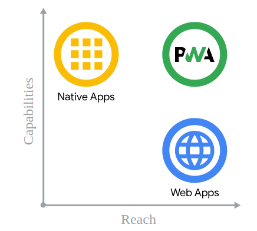

# PWA

Created: May 26, 2022
Created by: Lucas Mallmann
Property: https://web.dev/badging-api/, https://github.com/w3c/badging/blob/master/explainer.md#usage-examples, https://wicg.github.io/background-sync/spec/
Tags: Study, Work

- [PWA](#pwa)
- [Overview](#overview)
- [Os 3 Pilares](#os-3-pilares)
  - [Capacidades](#capacidades)
  - [Confibilidade](#confibilidade)
  - [Instalabilidade](#instalabilidade)
- [Melhor dos dois mundos](#melhor-dos-dois-mundos)

# Overview
A Web é uma plataforma incrível, capaz de alcançar pessoas do mundo inteiro com somente um codebase, permitindo compartilhar tudo com qualquer pessoa a qualquer momento. Sempre que acessa um site, ele está atualizado para te oferecer a melhor versão possível. Os aplicativos web podem alcançar **qualquer pessoa**, em **qualquer lugar** e a **qualquer momento**.

Os aplicativos nativos tem uma experiência muito mais "robusta", sendo conhecidos por sua confiança, por estarem disponíveis mesmo sem internet, podendo acessar recursos de hardware nativos, como por exemplo: USB, áudio, câmera.

As *Progressive Web Apps* (PWA) são aplicações aprimoradas com APIs modernas capazes de fornecer uma *confiabilidade*, *capacidade de instalação* e ao mesmo tempo, possuir o mesmo alcance das aplicações web convencionais:

  

# Os 3 Pilares
## Capacidades
Com o avanço de tecnologias como WebAssembly, agora é possível explorar tecnologias como C, C++, Rust, e desenvolver APIs para os browsers que dão suporte a recursos cada vez mais nativos. Hoje é possível construir uma aplicação web com tecnologia WebRTC, push-notifications, geolocalização, e isso tudo é permitido através das novas web apis que vêm sendo desenvolvidas ao longo dos anos.

A ideia é que essas APIs cresçam cada vez mais, permitindo acessar recursos ainda não suportados, como sistema de arquivos, controladores de mídia.

## Confibilidade
Uma PWA deve ser coniável de se utilizar. O fator confiável pode se dividir em 2 princípios: velocidade e suprote offline.
- A velocidade é de extrema importância, não devemos permitir que uma PWA deixe o usuário em dúvida se a ação de clicar em botão ou não foi registrada com sucesso. O desempenho afeta a experiência, e isso fere o pilar da confiabilidade.
- Suporte offline: o usuário deve conseguir acessar uma PWA independente de sua conexão com a internet estar lenta, ou indisponível. A aplicação deve conseguir entregar o conteúdo mais recente que interagiram, a faixa de mídia que escutaram, e quando algo não é possível de ser feito, o usuário deve receber uma mensagem informando que há problemas, ao invés de ver a aplicação quebrar.

## Instalabilidade
As PWAs são instaladas direto no device do usuário, e não são mais acessadas através do navegador. Isso permite que a pwa possa ser utilizada como padrão para abrir determinados tipos de arquivos, permite atalhos de teclado que não eram possíveis no browser, e o mais importante, muda o modo como o usuário pensa e interage com a aplicação.

# Melhor dos dois mundos
As PWAs une o melhor dos dois mundos, juntando os 3 pilares de um aplicativo + alcance. Utilizamos um único codebase que pode ser instalado em qualquer lugar, por qualquer pessoa.

O twitter obteve um aumento de 65% nas páginas por sessão, 75% mais tweets e uma redução de 20% na taxa de rejeição, além de diminuir o tamanho do aplicativo nativo. [fonte](https://web.dev/i18n/pt/what-are-pwas/#o-melhor-de-dois-mundos)